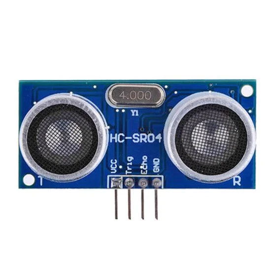
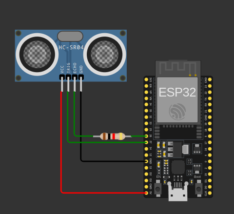

# 📌 Atividade 2 – Sensor Ultrassônico HC-SR04 com Arduino IDE e ESP-IDF

Nesta atividade desenvolvemos a leitura de distâncias utilizando o sensor **HC-SR04**, um sensor ultrassônico amplamente utilizado em projetos de IoT. O objetivo foi implementar o código tanto na **Arduino IDE** quanto no ambiente **ESP-IDF**, explorando o uso de bibliotecas, GPIOs e temporização para obter medições precisas de distância.

<p align="center">
  
</p>

## 🔧 Tecnologias e ferramentas utilizadas

- Arduino IDE
- ESP-IDF (Espressif IoT Development Framework)

## 🚀 Etapas da Atividade

1. **Montagem do circuito** com o sensor HC-SR04 conectado à placa de desenvolvimento (Arduino ou ESP32).
2. **Implementação do código** na Arduino IDE utilizando a lógica de medição baseada no tempo de retorno do sinal ultrassônico.
3. **Reescrita do código em C com ESP-IDF**, controlando os pinos via drivers de GPIO e utilizando funções de temporização.
4. Testes e validações dos valores de distância em diferentes superfícies e distâncias.

## 🌐 Simulações Wokwi


<p align="center">
  
</p>

- [🔗 Simulação ESP32 com HC-SR04 no Wokwi](https://wokwi.com/projects/428868399076983809)

## 📁 Estrutura de diretórios

```bash
atividade1/
├── assets/
│   ├── sensor_ultrasom.webp
│   └── simulacao.png
├── sensor_ultrasom_c/
│   ├── .pio/
│   ├── .vscode/
│   ├── include/
│   ├── lib/
│   ├── src/
│   │   ├── CMakeLists.txt
│   │   └── main.c
│   ├── test/
│   ├── CMakeLists.txt
│   ├── platformio.ini
│   └── sdkconfig.esp32doit-devkit-v1
├── descricao.md
├── ultrasom.ino

