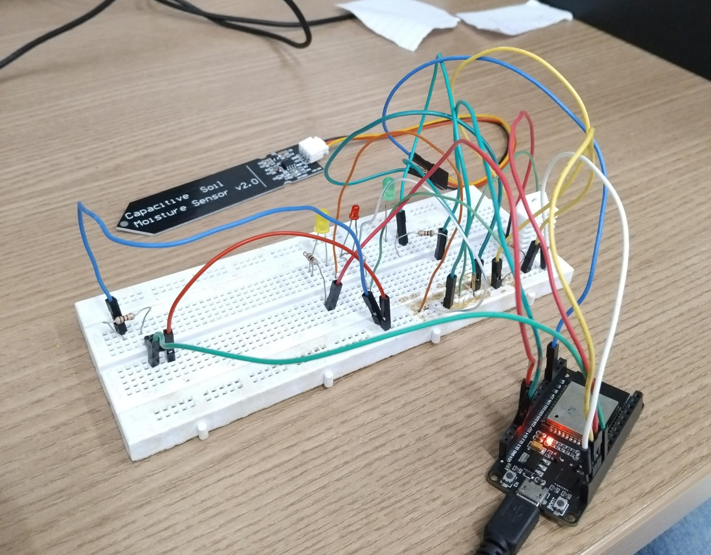

# 🩺 Projeto Final - Monitoramento de Pacientes

Este projeto tem como objetivo implementar um sistema de monitoramento remoto de pacientes utilizando sensores dde umidade conectados a uma plataforma IoT. A comunicação entre os dispositivos é realizada via protocolo MQTT, com visualização dos dados em tempo real através do Node-RED.

---

## ⚙️ Montagem do Circuito

foi desenvolvido a montagem do circuito online pela plataforma do wokiwi para realizar a simulação e um teste previo antes de realizar a montagem do circuito de fato.

<p align="center">
  
</p>

> [!IMPORTANT]\
> É aconselhavel elaborar o projeto primeiro em plataformas onlines como o [wokiwi](https://wokwi.com/) para realizar simulações e observar o comportamento dos elementos para evitar queima de componentes e mal uso deles.

### 🔧 Sensores e Materiais Utilizados

* **Sensor de umidade do solo:** CS12
* **Sensor de temperatura e umidade do ar:** DHT11
* **Microcontrolador:** ESP32 (ou ESP8266, conforme o caso)
* **Jumpers e protoboard**
* **Fonte de alimentação USB ou bateria**

<p align="center">
  
</p>

---

## 🔄 Comunicação via MQTT - Mosquitto Broker

Para permitir a comunicação entre o ESP e a interface de visualização (Node-RED), utilizamos o protocolo **MQTT (Message Queuing Telemetry Transport)**, um protocolo leve e ideal para dispositivos IoT.

### 📌 Conceitos-chave do MQTT:

* **Publicador:** dispositivo que envia (publica) dados para um tópico específico.
* **Assinante:** dispositivo ou aplicação que recebe (assina) os dados de um tópico.
* **Broker:** servidor central que recebe todas as mensagens publicadas e encaminha para os assinantes corretos.

  > Neste projeto, utilizamos o **Mosquitto** como broker MQTT.

### ⚙️ Passo a passo para configuração do broker Mosquitto

#### 1. Instalar o Mosquitto na sua máquina

No Linux (Debian/Ubuntu), você pode instalar o Mosquitto e suas ferramentas com o seguinte comando:

```bash
sudo apt update
sudo apt install mosquitto mosquitto-clients
```

> ⚠️ Caso esteja utilizando Windows, é possível baixar os executáveis no site oficial do projeto Mosquitto:
> [https://mosquitto.org/download/](https://mosquitto.org/download/)

---

#### 2. Atualizar o arquivo de configuração `mosquitto.conf`

O arquivo de configuração geralmente fica em:

```bash
/etc/mosquitto/mosquitto.conf
```

Nesse arquivo a configuração basica (se o seu projeto não nessecitar de senha) deve ser:

```conf
listener 1883 0.0.0.0
allow_anonymous true
```

##### 🚀 Iniciar o serviço com a configuração

Você pode reiniciar o serviço Mosquitto para aplicar a nova configuração:

```bash
sudo systemctl restart mosquitto
```

##### 🧪 Testando o broker Mosquitto com `mosquitto_pub` e `mosquitto_sub`

Com o broker do Mosquitto rodando na sua máquina, você pode criar tópicos e consumi-los para verificar se tudo está funcionando corretamente. Para isso, utilize os comandos abaixo em dois terminais diferentes:

#### ✅ 1. Consumir mensagens (ou seja, **assinar** um tópico)

Em um terminal, rode o seguinte comando para escutar um tópico:

```bash
mosquitto_sub -h localhost -p 1883 -t "teste/topico"
```

> Esse terminal ficará aguardando mensagens enviadas para o tópico `teste/topico`.

---

#### 📤 2. Publicar uma mensagem no tópico

Em outro terminal, publique uma mensagem no mesmo tópico:

```bash
mosquitto_pub -h localhost -p 1883 -t "teste/topico" -m "Olá, Mosquitto!"
```

> A mensagem `"Olá, Mosquitto!"` será exibida no primeiro terminal, confirmando que o broker está funcionando.

---

✅ **Dicas úteis**:

* Para ver todos os tópicos sendo utilizados no broker (caso ele esteja configurado para isso), você pode usar ferramentas de client MQTT como o [MQTTX](https://mqttx.app/).

## 🌐 Node-RED

O **Node-RED** é uma ferramenta baseada em fluxo para conectar dispositivos de hardware, APIs e serviços online de forma visual.

### Comunicação Node-RED -> broker

explicar como o node-red se comunica com o broker.

<p align="center">
  
</p>

### 🖥️ Dashboard

Criamos um painel de controle no Node-RED para visualizar em tempo real:

* Temperatura e umidade do ambiente
* Umidade do solo (representando, por exemplo, níveis de hidratação)

A dashboard foi configurada com elementos como:

* Gráficos em tempo real
* Indicadores numéricos
* Alertas visuais para limites críticos

<p align="center">
  
</p>